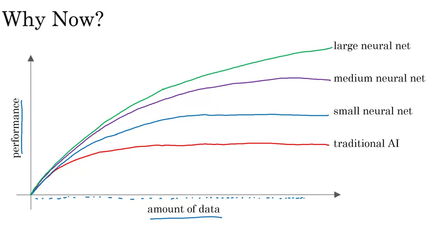

# 01.01 - Machine Learning

---

### Supervised Learning
- Learns A -> B, Input -> Output mappings
    - Input (A) -> Output (B) | Application
    - email -> spam? (0/1) | spam filtering
    - audio -> text transcript | speech recognition
    - English -> Chinese | machine translation
    - ad, user info -> click? (0/1) | online advertising
    - image, radar info -> position of other cars | self-driving car
    - image of phone -> defect? (0/1) | visual inspection
- Input to Output seems limiting but can be incredibly valuable
- This idea has been around for decades but has taken off in recent years

### Why Now?
- Performance keeps getting better with neural networks getting larger
