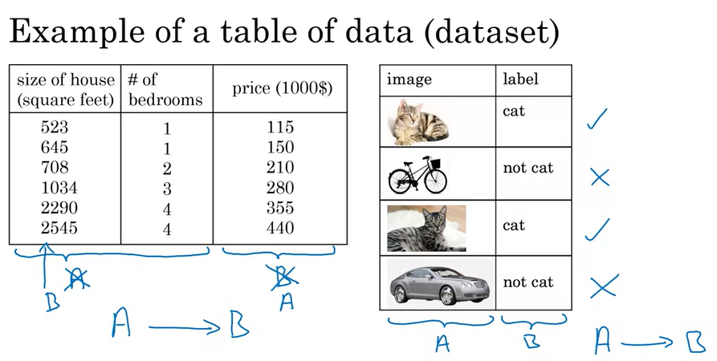
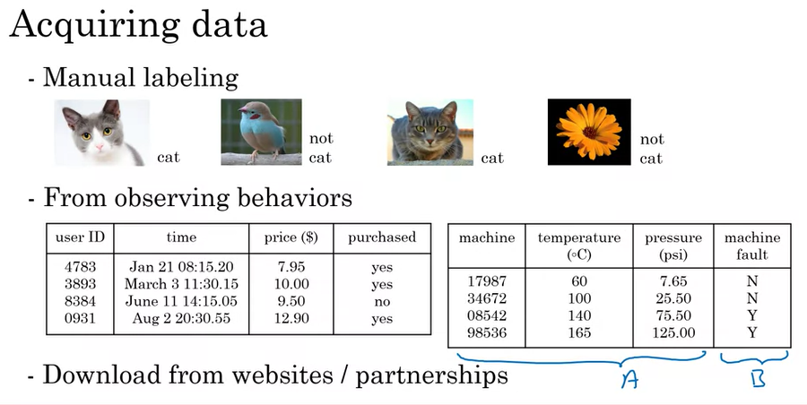

# 01.02 - What is data

---

### What is data, really?
- Example of a table of data (dataset)
size of house (square feet),price($1000)
523,115
645,150
708,210
1034,280
2290,355
2545,440

- Perspective is that it is a -> b mapping here for size to price
- But what if we include # of bedrooms?
size of house (square feet),# of bedrooms,price($1000)
523,1,115
645,1,150
708,2,210
1034,3,280
2290,4,355
2545,4,440

- Now we combine size and number of bedrooms as an input (a) to map to a price (b).
- It's up to you to decide what is a and what is b.
- Another example with the same dataset is that if you have a certain budget and want to decide the size of house you can afford, the input (a) is how much someone spends and the output (b) is the size of house someone can afford

    

### Acquiring data
- Manual labelling
- From observing behaviors
- Download from websites and partnerships
     It's very easy to get data

    

### Use and misuse of data
- Bad assumptions of IT with data collection
    - Hoarding data for future use without a goal doesn't mean you'll get good results
    - It's typically better to get AI input expertise early on the quality and potential outputs based on the data before getting comfortable thinking that the data collection is great
    - A lot of interplay between IT and AI teams
- Assuming that having a lot of data is valuable
    - Don't throw data to an AI team and assume it will be valuable

### Data is messy
- Garbage in, garbage out
    - Incorrect data hurts averages, analytics, things you can ascertain from 'trusted' information
    - Wastes time and misleads
- Data problems. 
    - Sometimes labels are incorrect
    - Sometimes there are missing values
- Multiple types of data
    - Images, audio, text
    - Dealing with structured and unstructured data are different