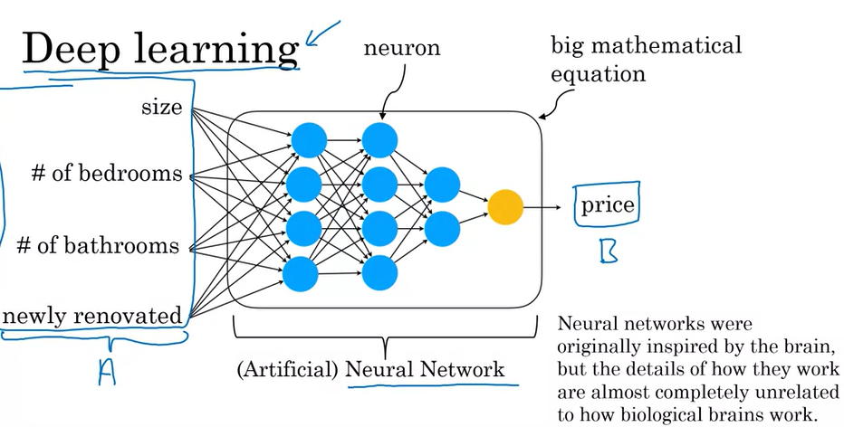

# 01.03 - The terminology of AI

---

### Machine Learning vs. data science
- Let's say we have a housing dataset like this:

    | size of house (square feet) | # of bedrooms | # of bathrooms | newly renovated | price (1000$)
    |:----|:--|:--|:--|:---
    | 523 | 1 | 2 | N | 115
    | 645 | 1 | 3 | N | 150
    | 708 | 2 | 1 | N | 210
    | 1034| 3 | 3 | Y | 280
    | 2290| 4 | 4 | N | 355
    | 2545| 4 | 5 | Y | 440

- Imagine we wanted to build a mobile app tobuy and sell houses... size, number of bedrooms, bathrooms and newly renovated would be input (A) for price, or output (b). This is machine learning - a to b mapping.
- Machine learning results in a running AI system.
- Let's say a team analyzes the data. For this example, homes with 3 bedrooms are more expensive than homes with 2 bedrooms of a similar size. Newly renovated homes have a 15% premium. This is data science.
- Data science's outputs are sets of insights that enable you to make business decisions.
- The boundaries between machine learning and data science are fuzzy and they are not used consistently today. These are simply common definitions.

### More formal definitions of machine learning and data science

- Machine learning is the "field of study that gives computers the abilitity to learn without being explicitly programmed." - Arthur Samuel (1959)
    - This is software that outputs b, given a

- Data science is the science of extracting knowledge and insights from data.
    - This is a slide deck that summarizes conclusions for executives or product teams

### Deep learning

- Involves a network/artificial neural network
- this big artificial neural network is a large equation that says 'given the inputs (a), how do you compute the price (b)?'
- A very effective technique for learning a to b (input to output) mappings
- Deep learning and machine learning are being used interchangeably

### AI has many tools
- Machine learning and data science
- Deep learning / neural network
- Other buzzwords: Unsupervised learning, reinforcement learning, graphical models, planning, knowledge graph...