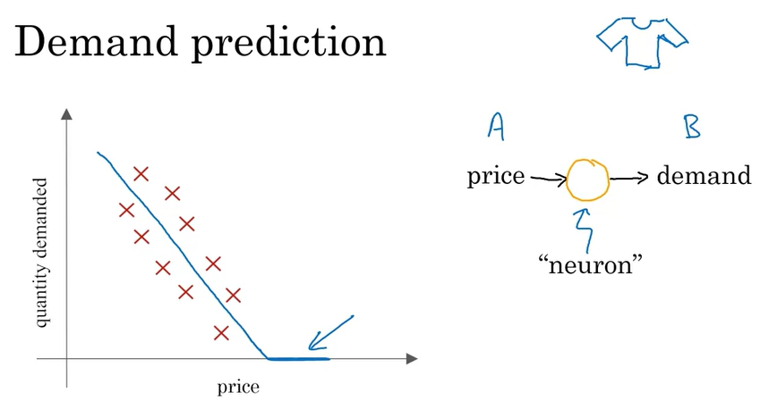
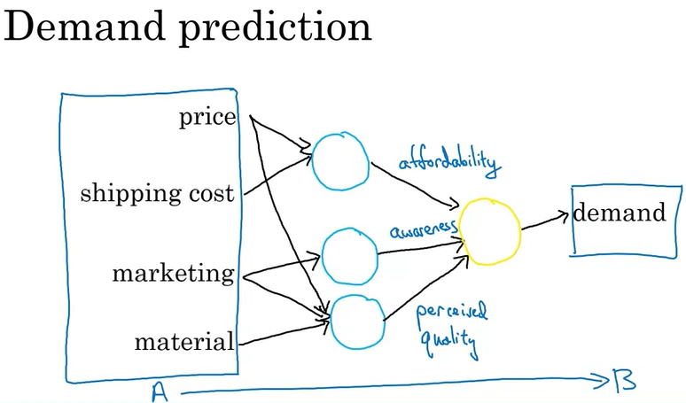
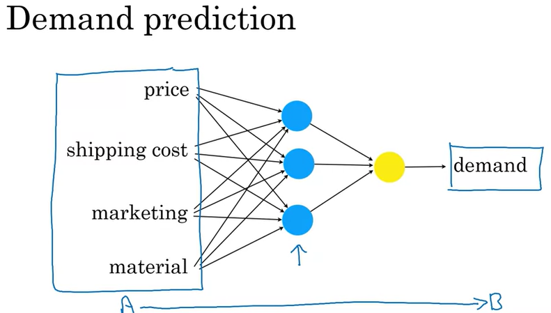
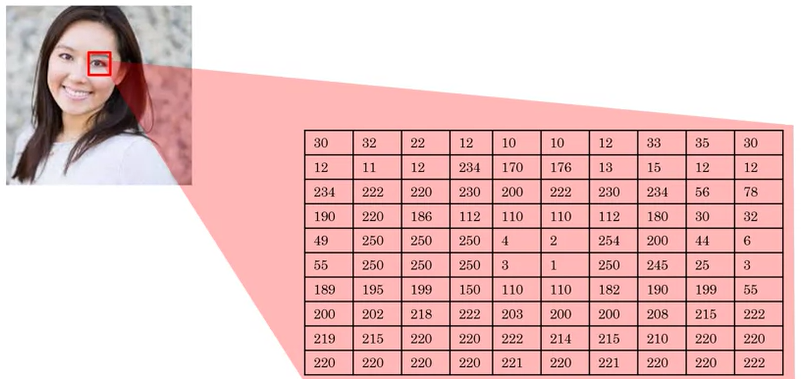
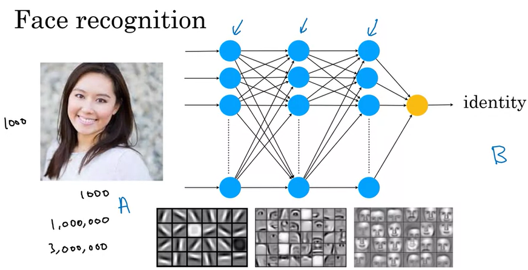

# Non-technical explanation of deep learning

---

### Demand prediction
- If you have a table where you're comparing quantity demanded versus price... you have a simple neural network (a) and want it output the estimated demand (b)
- You'd draw this with price being an input into the neural network, and it would output the demand
- The "neuron" computes the blue line which basically insinuates that when price goes up, demand goes down
    

- Let's see what a more complex example looks like. Suppose you know the price, shipping cost, marketing costs and material
- You know that your customer cares a lot about 'affordability' (blue neuron) that will estimate the affordability of the shirt. Affordability is a combination of the price and shipping cost
- Another element would be 'awareness' which is an outcome based on your marketing budget
- Another element would be 'perceived quality' based on the marketing and material
- All of these inputs going through another "neuron" produce a new output of 'demand'

    

- In practice neural neworks have thousands or tens of thousands of neurons
- To build an ML system using a neural network, you give it input (a) and output (b) and it figures out the neurons
- Feed input to neurons, they generate output neurons, the software's job is to figure out what the blue neurons should be computing for the most accurate possible function mapping
- It turns out that with enough data, this can be done well

    

### Facial recognition
- How can a neural network look at a picture and understand what's in a picture? Let's look at a more complex example
- Let's say you want a system to recognize people
- A system sees a grid of pixel brightness values for 

    

- A neural network can take inputs and review linear relationships... in this example, a neural network just needs to input a lot more numbers corresponding to the pixel brightness values of this picture
    - If it's black and white with a resolution of 1000 pixels by 1000 pixels, it's 1 million numbers of input for all 1 million pixels
    - If it's color, it's 3 million for the RGB values
- The neural network typically first starts by finding the edges... then certain parts... then faces... then eventually it outputs (b) the identity

    