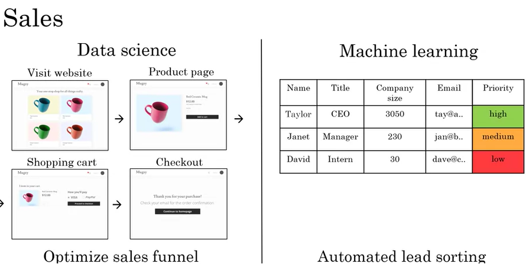
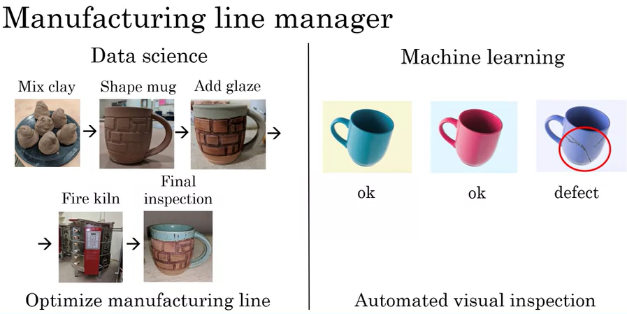
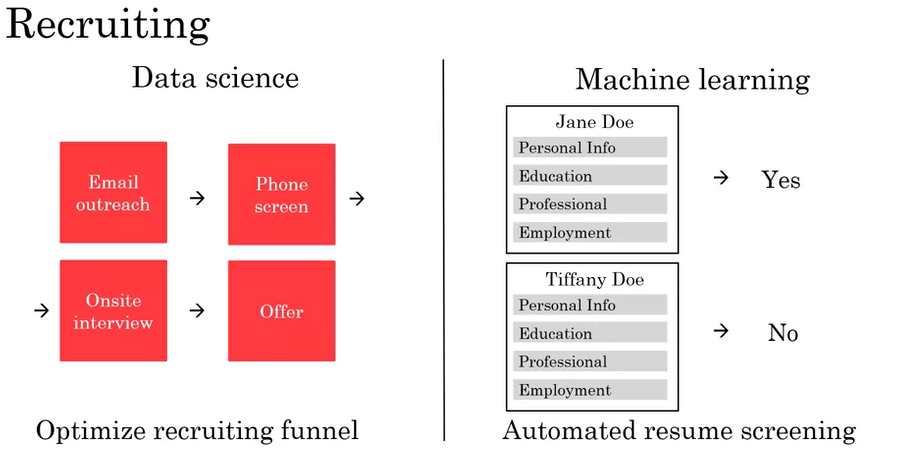
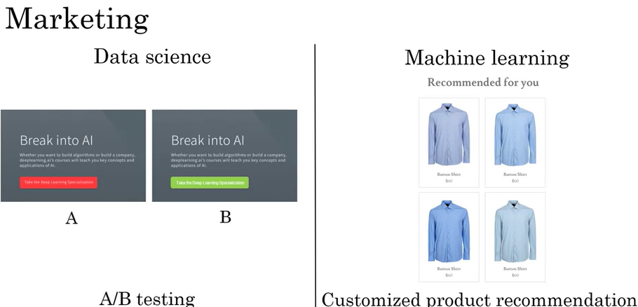
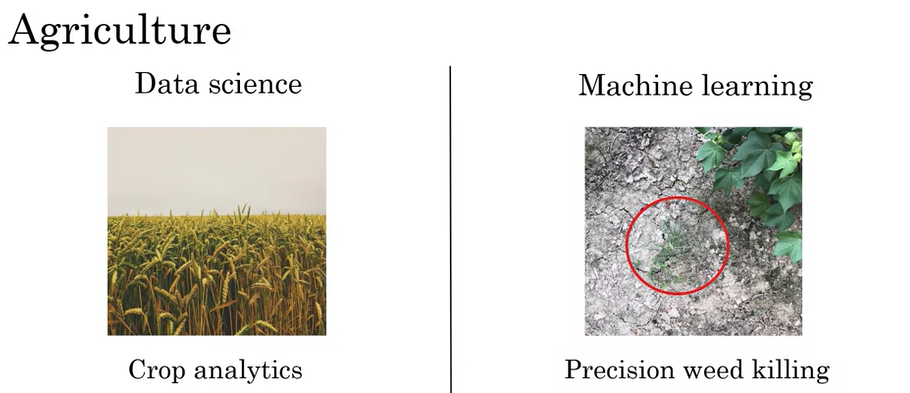

# 02.03 - Every job function needs to learn how to use data

---

### Examples of how data science and machine learning impact sales
- Data science
    - Can help optimize a sales funnel
    
- Machine learning
    - Can help to prioritize which personas/titles to tailor marketing to
        

### Examples of how data science and machine learning impact manufacturing
- Data science
    - Can help optimize manufacturing line
    
- Machine learning
    - Can provide automated visual inspection
        

### Examples of how data science and machine learning impact recruiting
- Data science
    - Can help optimize recruiting funnel
    
- Machine learning
    - Can provide automated resume screening
    - This is slightly risky considering ethics/bias but is being worked on
        
    
### Examples of how data science and machine learning impact marketing
- Data science
    - Can help with A/B testing
    
- Machine learning
    - Can provide customized product recommendation
        

### Examples of how data science and machine learning impact agriculture
- Data science
    - Can help with crop analytics
    
- Machine learning
    - Can provide precision weed killing
        