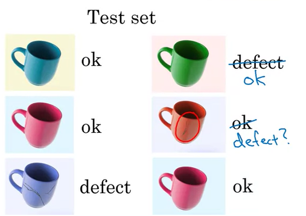

# 02.05 - Working with an AI team

---

### Specify your acceptance criteria
- Let's use automated visual detection as an example:
    - Goal: detect defects with 95% accuracy
    - How would you measure it? 
        - We'd need a dataset to validate the accuracy
        - Provide AI team a dataset on which to measure their performance
            - This is called a 'test set'
            - This example could have ~1000 pictures in the dataset
        - Think of how your acceptance criteria can be provided in a statistical way

### How AI teams think about data
- Group 1: Training set
    - A set of pictures with labels of a coffee mug with tags for 'ok' and 'defect'
    - Given this training set, a machine learning algorithm will compute/figure out some mapping of a to b to take input (picture) and output the desired result (tag)
- Group 2: Test set
    - Give images in test set and validate the correctness of the evaluations
    - If it got 2 out of 3 examples right, it'll only be 66.7% accurate
- For most problems, the training set is much, much bigger than the test set
- Sometimes, there's a third set (2nd test set) called a dev/validation set

### Pitcall: Expecting 100% accuracy
- Limitations of machine learning
- Insufficient data
- Mislabeled data
- Ambiguous labels

    