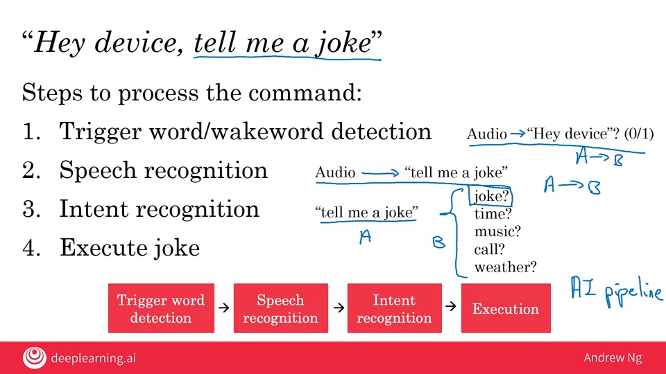

    # 03.01 - Case study of a Smart Speaker

---

### Smart speaker
- Amazon Echo / Alexa
- Google Home
- Apple Siri
- Baidu DuerOS

### "Hey device, tell me a joke"
- Steps to process the command:
1. Trigger word/wakeword detection (Audio -> "Hey device"? (0/1))
    - A to B mapping to see if the trigger word was said
2. Speech recognition (Audio after "Hey Device" -> "tell me a joke")
    - A to B mapping of the words said to a text transcript
3. Intent recognition (joke? time? music? call? weather?)
    - A to B mapping of text transcript to the type of command uttered
4. Execute joke

    

### Hey device, set timer for 10 minutes
- Steps to process the command:
1. Trigger word/wakeword detection
    - Audio -> "Hey device"? (0/1)
2. Speech recognition
    - Audio -> "set timer for 10 minutes"
3. Intent recognition
    - "set timer for 10 minutes" -> timer
4. Execute action
    1. Extract duration
        1. "Set timer for 10 minutes"
        2. "Let me know when 10 minutes is up
    2. Start timer with set duration

### Other functions
- Play music
- Volume up/down
- Make call
- Current time
- Units conversion
- Simple question

### Key steps:
1. Trigger/wakeword detection
2. Speech recognition
3. Intent recognition
4. Specialized program to execute command