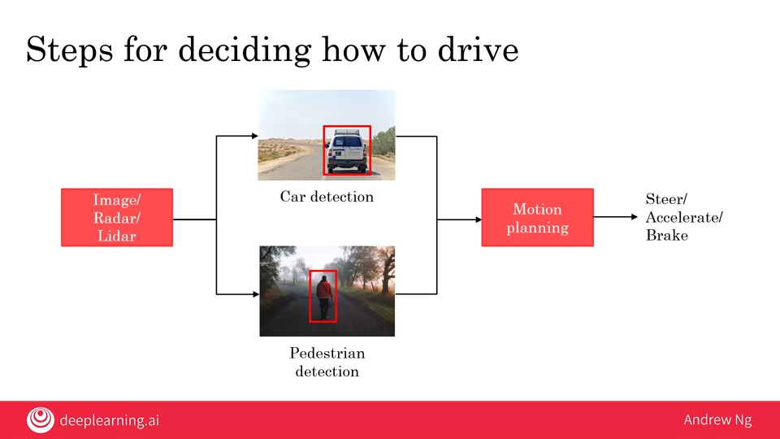
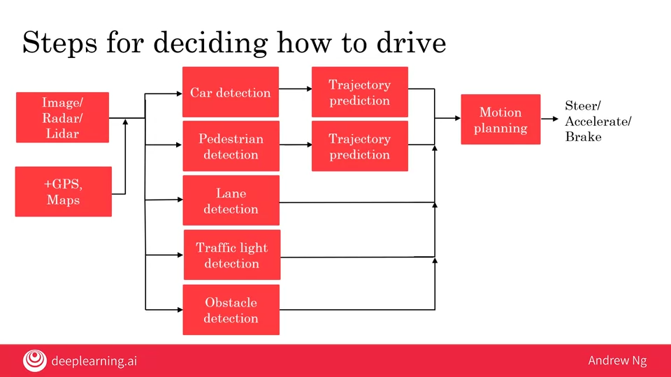

# 03.02 - Case study of a Self-driving car

---

### Steps for deciding how to drive
- Take pictures/radar/lidar
    - Car detection
    - Pedestrian detection
        - Motion planning
            - Steer/accelerate/Brake

    

### Key steps
1. Car detection
    - Supervised learning
    - Output detected cars
    - Use cameras, radar, lidar
2. Pedestrian detection
    - Supervised learning
    - Output pedestrians
    - Use cameras, radar, lidar
3. Motion planning
    - Tell you what path you should drive in order to follow the road and not have an accident
    - Output path and speed

### Steps for deciding how to drive
- Image/Radar/Lidar
- GPS, maps
    - Car detection
        - Trajectory prediction
    - Pedestrian detection
        - Trajectory prediction
    - Lane detection
    - Traffic light
    - Obstacle detection
            - Motion planning
                - Steer/accelerate/brake

    