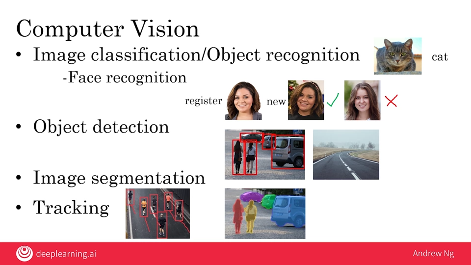
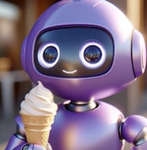
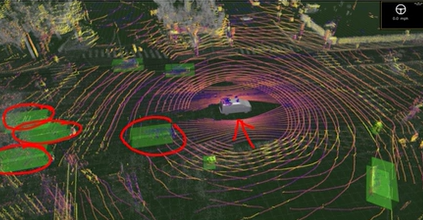

# 03.07 - Survey of major AI application areas

---

### Computer Vision
- Image classification/Object recognition
    - Face recognition
        - A user registers one or more pictures of their face
        - Given a new image, the AI system determines if it's the same person or different
    - Object detection
        - In building a self-driving car, the system can take a picture as input and know the position of pedestrians and other cars
        - Takes a photo as input and analyzes objects as output
    - Image segmentation
        - Another abstraction deeper of object detection
        - It draws very precise boundaries around objects that it finds
        - In reading X-rays for example, an image segmentation scan can understand where the heart, lungs, bones are etc.
    - Tracking
        - In video, can keep track of position of specific objects

        

### Natural Language Processing
- Text classification
    - Input of 'text' to 'pattern'
    - Another subtype is Sentiment recognition, or text to sentiment
- Information retrieval
    - E.g., web search
- Name entity recognition
- Machine translation

| Type | Classification
|:---------|:---------
| Email | Spam/Non-Spam
| Product description | Product category
| "The food was good" | ⭐⭐⭐⭐
| "The food was horrible" | ⭐
| "Queen Elizableth II knighted Sir Paul McCartney for his services to music at the Buckingham Palace." | - 'Queen Elizabeth II', 'Sir Paul McCartney' as people   - 'Buckingham Palace' as location
| AIは新しい電力です | AI is the new electricity

### Speech
- A waveform represents sound recorded
    - x axis represents data captured over time
    - y axis represents the actual recording (sounds, which are from variations in air pressure near microphone)
    - Determining how this works and how to 'replicate' digitally is interesting
- Speech recognition (speech-to-text)
    - Convert speech to text
- Trigger word/wakeword detection
    - Determine when a speaker is being engaged with
- Speaker ID
    - A specialized speech problem where the task is to listen to someone speak and figure out the identity of the speaker
- Speech synthesis (text-to-speech, TTS)
    - Converts text to speech
    - `The quick brown fox jumps over the lazy dog` is used as a common example as it contains every letter from A to Z. All 26 appear

### Generative AI
- Artificial intelligence systems that can produce high quality content, specifically text, images and audio.
    - Text generation
    - Image generation
    - Audio generation
        - Speech, music

    | Prompt | Output
    |:---------|:---------
    | "Suggest three funny creative names for a line of chocolate ice cream | 1. Choco-Chuckle Swirl 2. Fudge-tastic Delight 3. Silly Cocoa Scoops 
    | "A purple friendly robot eating ice-cream" | 
    | "drum solo 140 bpm" | *An audio track

### Robotics
- Perception: figuring out what's in the world around you based on the senses you have
    
- Motion planning: finding a path for the robot to follow
- Control: sending commanbds to the motors to follow a path

### General machine learning
- Unstructured data
    
    - Images
    - Audio
    - Text
- Structured data
    - Tables of data

        | Clay batch # | Supplier | Mixing time minutes
        |:---------|:---------|:--------
        | 001 | ClayCo | 35
        | 034 | GooClay | 22
        | 109 | BrownStuff | 28

        | Mug batch # | Humidity | Temperature in kiln (f) | Duration in kiln (hours)
        |:---------|:---------|:--------|:--------
        |301|0.002%|1410|22
        |302|0.003%|1520|24
        |303|0.002%|1420|22