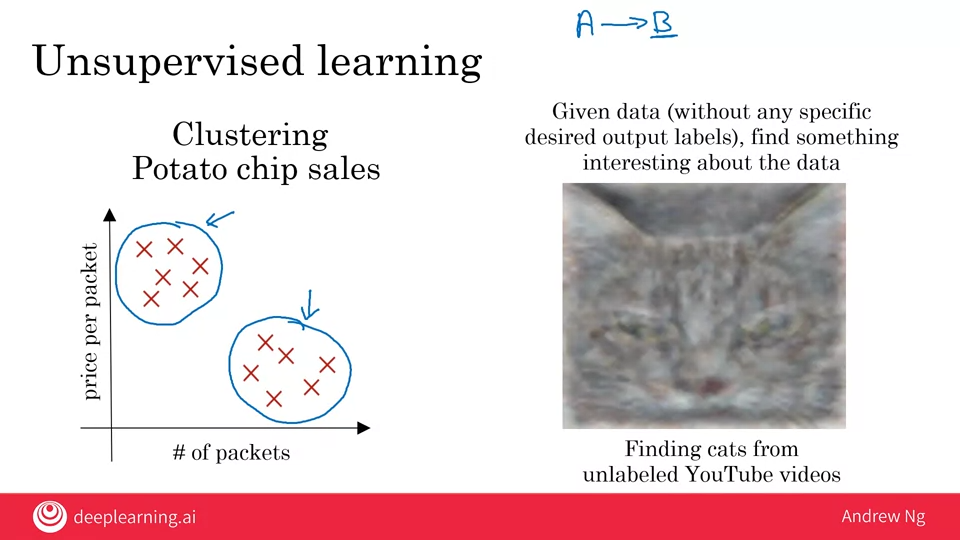
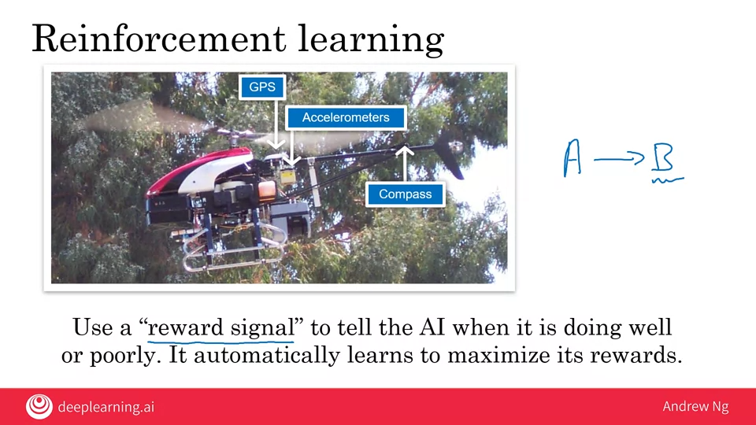
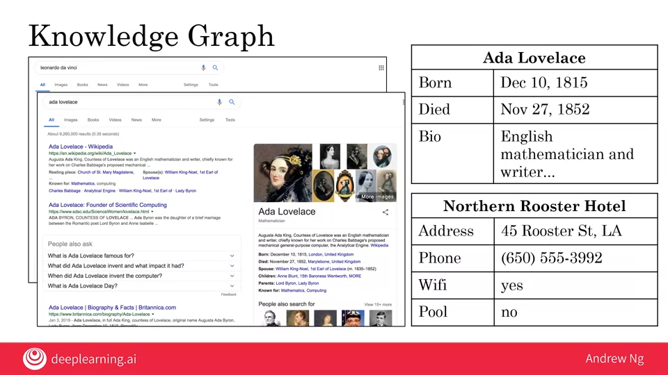

# 03.08 - Survey of major AI techniques

---

### Unsupervised learning
- Clustering
    - The best known example of unsupervised learning is clustering
        - An example is that we run a grocery store specializing in selling potato chips. We collect data on customers and on how many packets a person buys and the price per packet
            - We sell lower end cheaper potato chips and high end more expensive types of potato chips
            - Different people may buy different types and amounts per trip
        - A clustering algorithm will say that 'It looks like you have two clusters in your data, some of your customers buy inexpensive potato chips but buy a lot of packets like college students. The other cluster shows customers buying fewer packets but spending more per trip'
            - Two demographics:
                1. College students
                2. Working professionals

    

- Supervised learning
    - Learns in an A to B mapping. 
    - You have to tell it what you want

- Unsupervised learning
    - Given data (without any specific desired output labels), find something interesting about the data
    - Is told to find something meaningful in the data. The clustering algorithm doesn't know about demographics, it just tries to find what the different market segments are in advance.

- An example was finding cats in unlabeled YouTube videos
    - Andrew had his team run an unsupervised learning algorithm on a large dataset of YouTube videos
    - It found many cats, because stereotypically many videos are uploaded. It discovered 'cat' all by itself.
    - It's hard to visualize what these algorithms 'think' 

### Hope in unsupervised learning
- AI systems require much more data than an animal or human child to learn
- AI researchers hold a lot of hope for the future of unsupervised learning given that it takes unlabeled data
- The value of it today is smaller than supervised at the moment

### Transfer learning
- Car detection to Golf cart detection as an example
    - Learnings for car detection of 100,000 images can be leverage with golf cart and 100 images
    - Learn from Task A and use knowledge to help on Task B

### Reinforcement learning
- Lets say you want a helicopter with a GPS, accelerometers and a compass (always knows a position) to be able to fly itself
    - Doing this with supervised (a to b) learning is too much
- How do you do this with a dog you want to train?
    - Praise (reward) with good
    - Punish (no reward) with bad
- Have the helicoper fly around in a simulator and let it fly however it wants
    - Whenever it flew it well, it was praised. When it flew poorly it was punished.
    - The AI learned how to fly well in essence by determining how to get the most rewards.
    - Use a "reward signal" to tell the AI when it is doing well or poorly. It automatically learns to maximize its' rewards.

        

- This helped to produce one of the most capable autonomous helicopters in the world

### GANs (Generative Adversarial Network)
- Synthesize new images from scratch
- This person does not exist
- Exciting work on this, will impact entertainment industry

### Knowledge Graph
- Information panel commonly found with web searches now
- Pulls from a database of key info about these people in an easy-to-consume form
    - Not limited to people, hotels, scenic attractions, etc. have them too
- Popularized by Google but has been spread to other companies
        