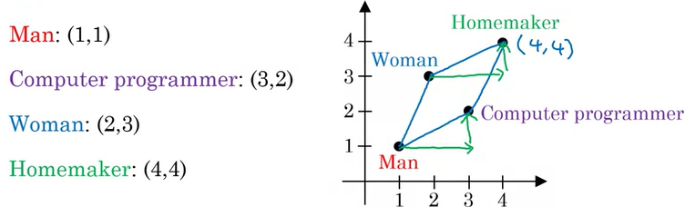

# 04.02 - Discrimination and bias

---

### AI learning unhealthy stereotypes
- A group at Microsoft found that when systems learn from text on the internet, it can learn unhealthy stereotypes
    - By having an AI read text, it can learn words and can reason with anologies
        - `Man : Woman as Father :` ?
        - AI will output the word `Mother`
        - `Man : Woman as King :` ?
            - AI will output the word `Queen`
        - `Man : Computer programmer as Woman:` ?
            - AI will output the word `Homemaker`
            - A less biased answer would be `Computer programmer`

- The way an AI system stores words is as a number, through statistics of how the word is used
    - For example `Man: (1,1)`
    - Plot on a chart
    - By looking at the phrase is used on the internet, the AI will have a different pair of numbers to represent the phrase `Computer programmer: (3,2)` and for others `Woman: (2,3)`
    - The AI will create a parallelogram, asking for the word associated with the position `4,4` to complete the analogy

        

### Why bias matters
- Hiring tool that discriminated against women
    - Company shut the tool down
- Facial recognition working better for light-skinned than dark-skinned individuals
    - Creates a very biased and unfair effect
- Bank loan approvals
    - Creates biased loans for minorities
- Toxic effect of reinforcing unhealthy stereotypes
    - Becomes more and more important as more content is AI-generated
    - What if an 8-year old girl looks up `CEO` - will she see any women?

### Combating bias
- Technical solutions
    - E.g., "zero out" the bias in words (for homemaker example)
    - Use less biased and/or more inclusive data
- Transparency and/or auditing processes
- Diverse workforce
    - Creates less biased applications