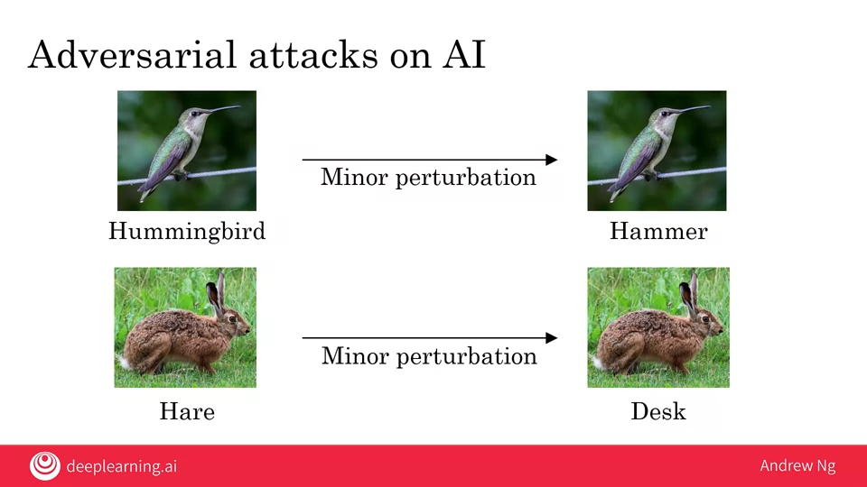
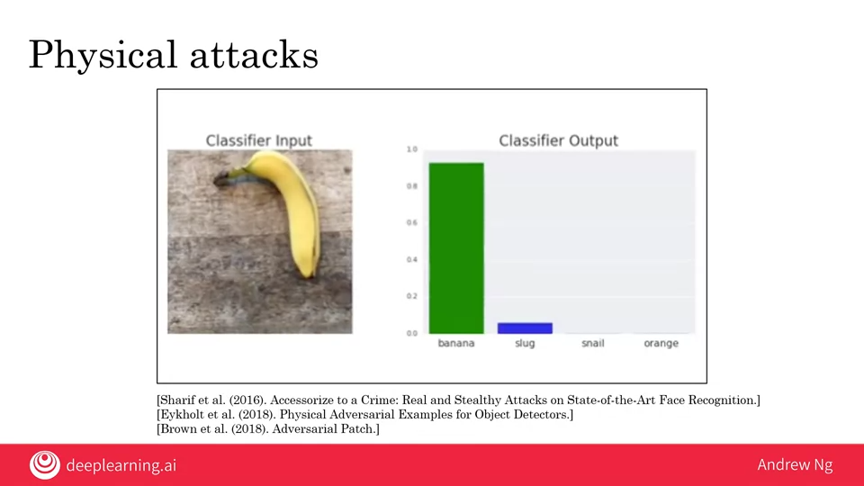
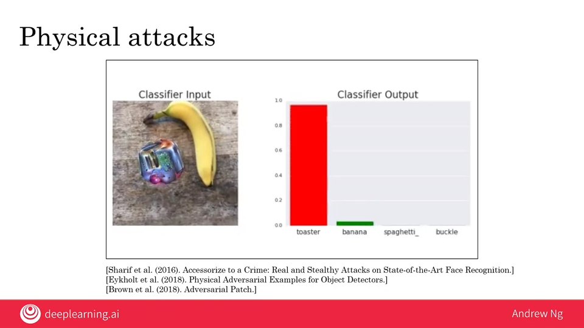

# 04.03 - Adversarial attacks on AI

---

### Adversarial attacks on AI

#### Digital attacks
- Let's say we ask an AI system to classify a picture of a bird and it produces `Hummingbird`. Then, we make a minor perturbation (imperceptible change of pixels), ask again, and the system produces `Hammer`
- In computer security, an `attack` means an attempt to make it do something other than it was intended to do. Same for AI
    

### Physical attacks
- A group of students at Carnegie Mellon created a pair of glasses that makes the man identified by AI thinks that he is actress Milla Jovovich
- Another group of researchers from other universities show that if you affix stickers to stop signs, you can fool systems to not seeing them at all
    

- A group of researchs at Google found that if you put a sticker in a scene, it'll get misclassified
    
    

### Adversarial defenses
- Defenses do exist, but incur some cost
- Similar to spam vs. anti-spam, we may be in an arms race for some applications