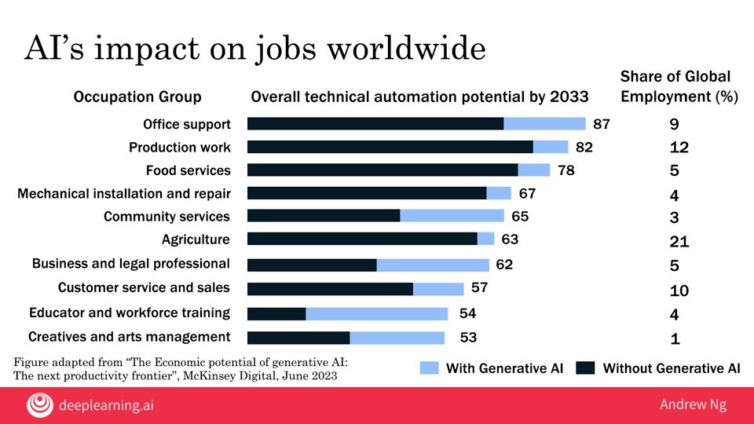

# 04.06 - AI and jobs

---

### Headline
- AI is automation on steroids. Before the rise of modern AI, automation had already had a huge impact on a lot of jobs. With the rise of AI, the set of things we can automate is much bigger than before and is having an accelerated impact on jobs

### AI's impact on jobs worldwide
- McKinsey Global Institute estimates that 400-800 million jobs will be displaced by 2030
- They also estimate that 555-890 million jobs will be created by 2030
- There's a lot of uncertainty on the impact but most agree that it will be significant

### Fun possible future jobs
- Drone traffic optimizer
- 3d printed clothing designer
- Custom DNA-based drug designer

### AI's impact on jobs worldwide

### Some solutions
- Conditional basic income: provide a safety net but incentivize learning
- Lifelong learning
    - Old-school method of going to college and coasting isn't tenable anymore
- Political solutions